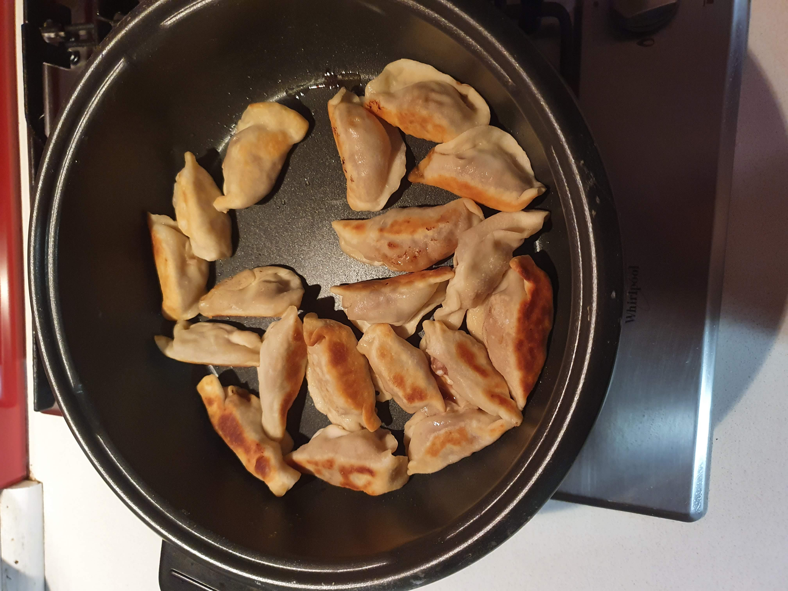
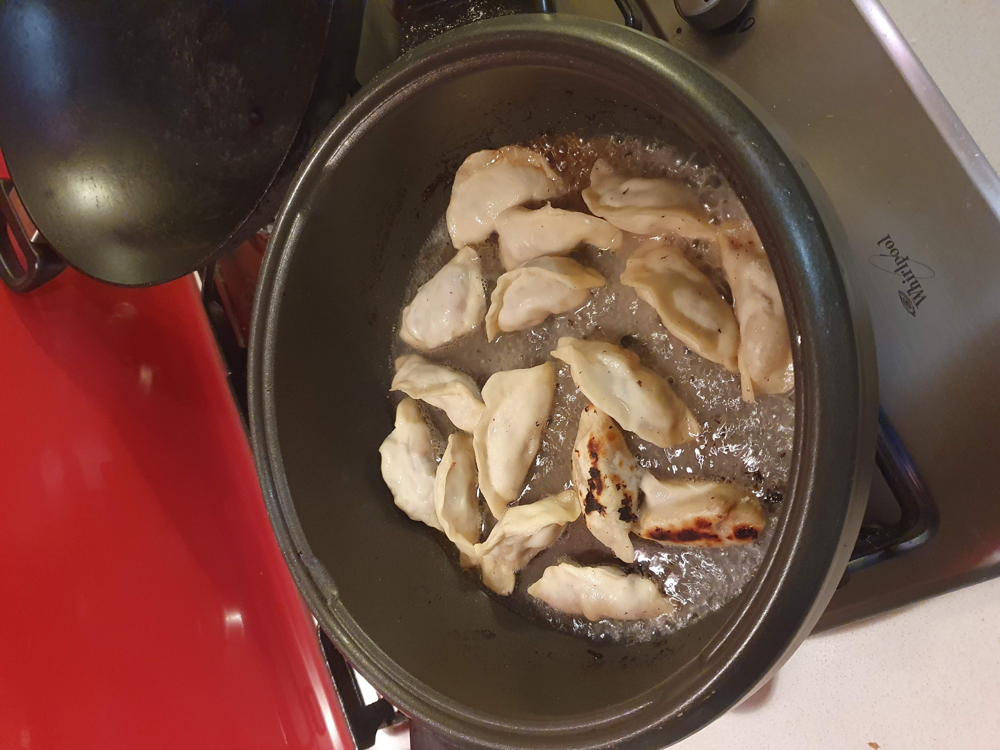

# Potsticker Dumplings
#### Software for your stomach

I used to make these a lot but got out of the habit for some reason. I first learned about them in Wuhan (you may have heard of the place). I just got off the boat that had taken me down the Yangtze river and stumbled into a restaurant. They're not unique to this area by any means. You can get them all over China.  

They're called `guotie` _(guo-tee-yeah)_, `jiaozi` _(ji-ow-za)_. The Japanese call their version `gyoza` but acknowledge that it's really a Chinese thing 
(the word `gyoza` is derived from `jiaozi`). In English they're translated literally as `pot stickers`.

The quantities I'm giving here will feed a family of four non-footballers.

## Ingredients

* 350 grams of minced pork 
  If you don't eat pork there are lots of good alternatives. 
  I'd suggest veal but chicken or beef might be OK. 
  There is a vegetarian version too (although I'm not sure of the ingredients).
* 1 cm of fresh ginger finely minced
* 1 garlic finely chopped
* 1 spring onion, finely shredded and diced finely
* half a container of mushrooms (say, 5?)
  For this i'd suggest shitake mushrooms but I used abalone mushrooms last time
* 1 cup of finely shredded Chinese cabbage make sure it's really chopped fine. I actually used lettuce last time. 
* 1 tablespoon of soy sauce
* 1 tablespoon of dark soy sauce, the really thick stuff, moves like mollasses
* 1 tablespoon of rice wine or dry sherry or your finest VSOP cognac! (optional)
* 1 teaspoon of sesame oil (optional)

Any other sauces you might like to try (teriyaki, bulgogi etc.). They all work as flavourings.

None of these ingredients or quanitities are strict, just mix and match what you like. You need some saltiness to 
go with the mince meat, you need some vegies in there to lighten the taste and to balance your cosmic energies. 
Yin and Yang science FTW! 

In a large bowl just put all the ingredients together and stir them up until well mixed.

## Wrappers

While you can definitely buy wrappers, I'm going to tell you right now that the extra effort of making your own dumpling wrappers 
is really worth it and probably the main reason to follow this recipe at all. 
Commercial wrappers are thin like wontons, home made wrappers are thicker and more absorbant. 
This turns a entree into a decent meal.

* 1.5 cups of white flour
* 1 tablespoon of vegetable oil
* 3/4 cup of warm water 

Put the flour and oil in a large bowl and using a knife or a chopstick to slowly stir in the water until you get a soft dough.
Don't use all the water if it's getting too sticky. If it's already sticky, add some more flour to soak it up. 
Knead the dough for ten minutes or so until it's a well mixed lump. You could leave it stand for 10 minutes (optional).

Turn out the dough and roll into a long strip cut into pieces and roll them into approximately 2 cm sized balls.
Dust the surface with flour and roll the balls into disks about 10cm in size and about 2 mm thick. 
Nothing needs to be precise. You should be able to make 30+ dumplings depending on their size.

Take a teaspoon of the mince mixture and put it in the centre of the wrapper. 
Dip your fingers in water (keep a small bowl of water handy) and wet the outer edge of the wrapper.
Close the wrapper like a little envelope and seal the edge. 

Get a non-stick frying pan with a lid although you can do this without a lid too. Having two pans on the go would be even better.

Put a tablespoon of oil in the pan and fry the bottoms of the dumplings. 
You might fit 10 dumplings in the pan. 
Fry them a bit until they're lightly browned on one side. About 5 minutes. 
Then cover the dumplings with about 1 cm of water (or chicken stock) and simmer covered until the dumplings are cooked 
and all the water has been absorbed or evaporated. About 10 minutes. 
Take the cover off for the last few minutes to help with the evaporation.

Serve immediately with Chinese black vinegar and shredded ginger as a dipping sauce.
You could also serve with dried chillies in oil.
I'm sorry to say this but you're NOT allowed to dip these in soy sauce. It's actually the law! 
Pot stickers need black vinegar!

