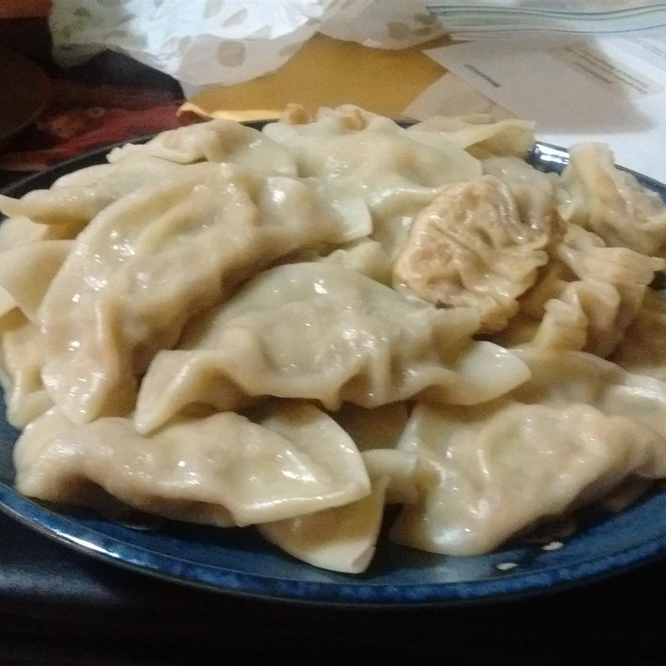
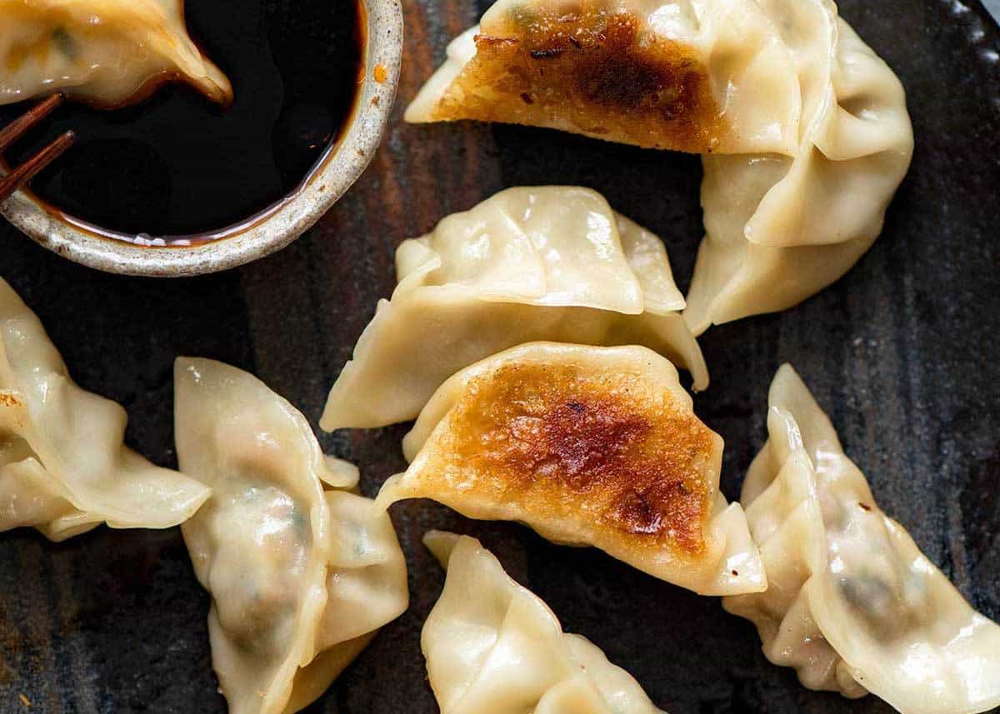

# Potsticker Dumplings
## Software for your stomach

I used to make these a lot but got out of the habit for some reason. I first learned about these in Wuhan (you may have heard of the place) 
they're called `guotie` _(guo tee yeah)_, `jiaozi` _(ji-ow-za)_. The Japanese called their version `gyoza` but acknowledge that it's a Chinese thing 
(the word `gyoza` is derived from `jiaozi`). In English they're translated literally as `pot stickers`.
The quantities here will feed a family of four non-footballers.

Ingredients:

* 250 grams of minced pork 
  if you don't eat pork there are lots of good alternatives, i'd suggest veal but chicken or beef, there is a vegetarian version too although I'm not sure of the ingredients)

* 1 cm of fresh ginger finely minced
* 1 garlic finely chopped
* 1 spring onion, finely shredded and diced half a container of mushrooms, i'd suggest shitake mushrooms but I used abalone mushrooms last time, any mushrooms
* 1 cup of finely shredded cabbage, makes ure its really fine to mix into the mince. I actually used lettuce this time 
* 1 tablespoon of soy sauce
* 1 tablespoon of dark soy sauce, really thich stuff like mollasses
* 1 tablespoon of rice wine or dry sherry or your finest VSOP cognac! (optional)
* 1 teaspoon of sesame oil

None of these ingredients or quanitities are strict, just mix and match what you like. You need some saltiness to 
go with the mince meat, you need some vegies in there to lighten the last and to balance your cosmic energies. 
Yin and Yang science! 

In a large bowl just put all the ingredients together and stir them up until well mixed.

Wrappers:

While you can definitely buy wrappers, I'm going to tell you right now that the extra effort of making your own dumpling wrappers 
is really worth it and probably the best reason to follow this recipe. Commercial wrappers are thin like wontons, home made wrappers
can feed a family.

* 2 cups of white flour
* 1 tablespoon of vegetable oil
* 1 cup of warm to hot water 

Put the flour and oil in a large bowl and using a knife or a chopstick slowly stir in the water until you get a soft dough.
Don't use all the water if it's getting too sticky. If it is add more flour to soak it up. Knead the dough for ten minutes 
or so until it a well mixed lump. You could leave it for 10 minutes.

Turn out the dough and roll into a long strip cut into pieces and roll into approximately 2 cm sized balls.
Dusting the surface with flour and roll the balls into disks about 10cm in size and about 2mm think. 
Nothing needs to be precise, I'm working from memory. You should be able to make 30+ dumplings depending on the size.

Take a teaspoon of the mince mixture and put it in the centre of the wrapper, 
dip your fingers in water (keep a small bowl of water handy) and use it to wet the outer edge of the wrapper.
close the wrapper and seal the packet 

Get a non-stick frying pan with a lid although you can do this without a lid too. Having two pans on the go would be ideal.

Put a tablespoon of oil in the pan and fry the bottoms of the dumnplings you might fit 10 dumplings in. 
Fry them a bit until they are lightly browned on one side, say 5 minutes 
Then cover the dumplings with 1 cm of water (or chicken stock) and simmer until the dumpling are cooked 
and all the water has been absorbed or evaporated.

Serve immediately with Chinese black vinegar and shredded ginger as a dipping sauce.
You could also serve with dried chillies in oil.
I'm sorry but you're not allowed to dip these in soy sauce. It's the law! 
Pot stickers need black vinegar (although my take way guy doesn't always believe me)

